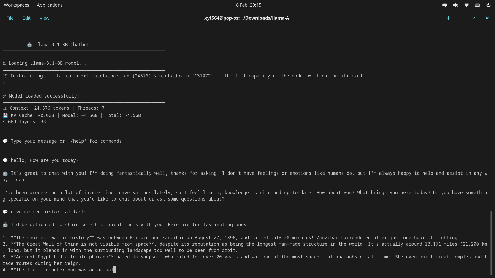

# 🤖 Llama-3.1-8B Local CLI Chatbot

A fast, fully local CLI chatbot powered by **Meta Llama-3.1-8B-Instruct** using `llama-cpp-python`.

This project is optimized for low-to-mid range hardware and provides a smooth streaming chat experience directly in your terminal — no APIs, no cloud, fully offline.

---

## ✨ Features

- ⚡ Optimized for 8GB RAM systems  
- 💬 Real-time streaming responses  
- 🧠 Persistent chat history (JSON)  
- 📊 Built-in chat statistics  
- 🗂️ Save and manage multiple conversations  
- 🖥️ Clean and simple CLI interface  
- 🔒 Fully local inference (no internet required after setup)  
- 🇬🇧 Timezone-aware chat timestamps (Europe/London)

---

## 🧪 Tested Hardware

**This project has ONLY been tested on the following system:**

- **CPU:** Intel i3-1215U  
- **RAM:** 8GB  
- **GPU:** Intel UHD Graphics  
- **OS:** Linux (Pop!_OS / Debian-based)

> ⚠️ Performance and memory usage may vary on other hardware.

---

## ❗ Important — Model Not Included

The AI model is **NOT included in this repository** because GitHub has file size limits.

You must download the model manually from Hugging Face.

---

## 📥 Required Model

Download the GGUF model from:

👉 https://huggingface.co/bartowski/Meta-Llama-3.1-8B-Instruct-GGUF

**Required file:**

```
Llama-3.1-8B-Instruct-Q4_K_M.gguf

```

---

## 📁 Project Structure

After setup, your project should look like:

```

.
├── main.py
├── requirements.txt
├── models/
│   └── Llama-3.1-8B-Instruct-Q4_K_M.gguf
├── chat_history/
└── assets/

````

---

## 🚀 Installation

### 1. Clone the repository

```bash
git clone https://github.com/Xyt564/llama-ai-chatbot.git
cd llama-ai-chatbot
````

---

### 2. Install dependencies

```bash
pip install -r requirements.txt
```

---

### 3. Create the models directory

```bash
mkdir -p models
```

> Save ur Ai model in this models folder

---

### 4. Download and place the model

Move the downloaded file to:

```
models/Llama-3.1-8B-Instruct-Q4_K_M.gguf
```

⚠️ The program will fail to start if the model is not in this exact location.

---

### 5. Run the chatbot

```bash
python3 main.py
```

On first launch, the model will load into memory — this may take a little time on lower-end CPUs.

---

## 💬 Available Commands

Inside the chatbot, you can use:

| Command        | Description                |
| -------------- | -------------------------- |
| `/help`        | Show help menu             |
| `/clear`       | Clear current chat history |
| `/save [name]` | Save conversation          |
| `/list`        | List saved chats           |
| `/stats`       | Show chat statistics       |
| `/history [n]` | Show recent messages       |
| `/quit`        | Exit the program           |

---

## 📸 Screenshot / Demo:



---

## ⚙️ Performance Notes

This configuration is tuned specifically for **8GB RAM systems**: 

* Context length: **24k tokens**
* Quantization: **Q4_K_M**
* CPU threads: **7**
* KV cache: ~6.5GB
* Model size: ~4.5GB

> can be made less but it will very slowly. visit my phi-2 gui ai chatbot for lower ram systems

If you experience:

* ❌ Out of memory
* ❌ Heavy swapping
* ❌ Slow responses

You may need to:

* reduce `n_ctx`
* reduce threads
* use a smaller quant

---

## 🛠️ Requirements

* Python **3.10+**
* Linux recommended
* ~7GB free RAM minimum
* GGUF model file

---

## 📌 Notes (Only do this if you know what ur doing)

* Runs CPU-only by default
* GPU acceleration can be enabled by adjusting `n_gpu_layers`
* Chat history is stored in `chat_history/`
* Streaming is enabled for better responsiveness

---

## ⭐ Acknowledgements

* Meta — Llama models
* llama.cpp
* llama-cpp-python

```
